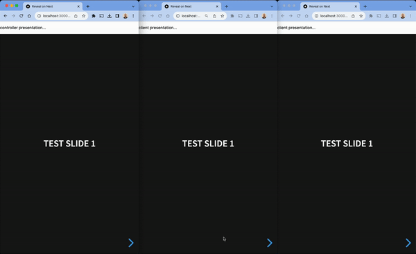

# test-reveal-on-next

This is a simple application that allows the incorporation of a [Reveal.js](https://revealjs.com/) presentation into a [NextJS](https://nextjs.org/) / [React](https://react.dev/) application, and subsequent multiplexing of the presentation across a controller and any number of clients.

Multiplexing allows the controller to update all the clients as it moves through the presentation. Effectively, they follow along...



## Test this app

```bash
npm run dev
```

## Developer notes

The following notes outline an approach to developing a Next/React application that incorporates a Reveal presentation.

### Install node and npx

```bash
brew install node
npm install -g npx
```

### Create the app

```bash
npx create-next-app@latest
```

### Install `reveal.js`

There are a few react-reveal packages that wrap Reveal for React/Next applications, but they're a little out of date now (the latest was last updated 3 years ago), and aren't really suited to Next or server-side rendering without some extra work.

Install `reveal.js` directly:

```bash
npm install reveal.js
```

### Create a presentation component

**See `components/presentation.tsx`**

`reveal.js` will only run in a browser environment, as it needs access to client specific javascript objects, such as `navigator`. It also needs to be able to see the `div` elements with `reveal` and `slides` CSS classes, as soon as it is created. This code forces Next to only invoke it in a browser...

This is an invocation for Next - telling it that the component needs client-side rendering:

```tsx
'use client';
``` 

`Reveal` is only initialized inside a `useEffect` - which is called when the page and divs are ready:

```tsx
useEffect(() => {
    const deck = new Reveal({ embedded: true, plugins: [ Markdown ]});
    deck.initialize();
}, []);
```

The `embedded` option is set to true - and this helps to incorporate other layout and elements alongside the presentation. As the presentation no longer automatically fills the page, the `reveal` `div` will need to have its size specified in CSS...

### Modify `globals.css`

**See: `app/globals.css`**

The global CSS has been simplified and adjusted to help fit the presentation to the page. If you are using another framework, such as [MUI](https://mui.com/), you may need to solve this another way.

Here, you can see that `margin` and `padding` on `html` and `body` have been zeroed. This removes any whitespace around the edges of the page.

`body` has also been set to `display: flex` (in column direction), which will allow us to resize the presentation to fit below any layout above it.

### Import the presentation component

**See: `app/slides/page.tsx`**

`dynamic` is used to import the `Presentation` element dynamically, with `ssr: false` to prevent server-side rendering.

The `Presentation` element is provided with child elements that contain the content to display. This allows the rendering of different content for different pages.

## Dynamic content

There are a confusing selection of packages: 

* [html-react-parser](https://www.npmjs.com/package/html-react-parser) (updated recently)
* [html-to-react](https://www.npmjs.com/package/html-to-react) (updated recently)
* ~~[react-html-parser](https://www.npmjs.com/package/react-html-parser)~~ (updated 6 years ago)

Install `html-react-parser`

```bash
npm install html-react-parser
```

This is used in `PresentationComponent` to retrieve content and render it dynamically.

**NB.** `html-react-parser` is simple to use, but not XSS-safe, and should be used with caution. `html-to-react` offers more control over the content that's rendered, and could be used safely.

## Multiplexing

Multiplexing allows a controller presentation to send its state to client presentations on other devices (ie. to allow them to follow along).

There are 3 components:

* Any number of client presentations
* A controller* presentation, with the same slides
* A socket.io based server that passes messages between the various presentations

_*Sometimes referred to as a master presentation._

### The server

This demo uses the server at: https://reveal-multiplex.glitch.me/

```tsx
const SOCKET_IO_SERVER = 'https://reveal-multiplex.glitch.me/';
```

* To test locally, you could also run your own server.
* A production system should host its own server.
* See: [reveal/multiplex](https://github.com/reveal/multiplex)

### Client and controller

Install the multiplex plugin:

```bash
npm install reveal-multiplex
```

The Presentation component in `presentation.tsx` accepts several parameters:

* `secret` (a secret to permit control, or `null` if acting as the client)
* `id` (the id of the presentation)
* `role` (not currently used)

* To collect a fresh secret and id from the server, visit: https://reveal-multiplex.glitch.me/token

The multiplex plugin is configured during initialization of Reveal:

```tsx
multiplex: {
    secret: secret,
    id: id,
    url: SOCKET_IO_SERVER
},
dependencies: [
    { src: 'https://reveal-multiplex.glitch.me/socket.io/socket.io.js', async: true },
    { src: 'https://reveal-multiplex.glitch.me/master.js', async: true },
    { src: 'https://reveal-multiplex.glitch.me/client.js', async: true },
]
```

Because these dependencies rely on being able to find `Reveal` as a global variable, we also add this, just before initialization:

```tsx
window.Reveal = reveal;
```
